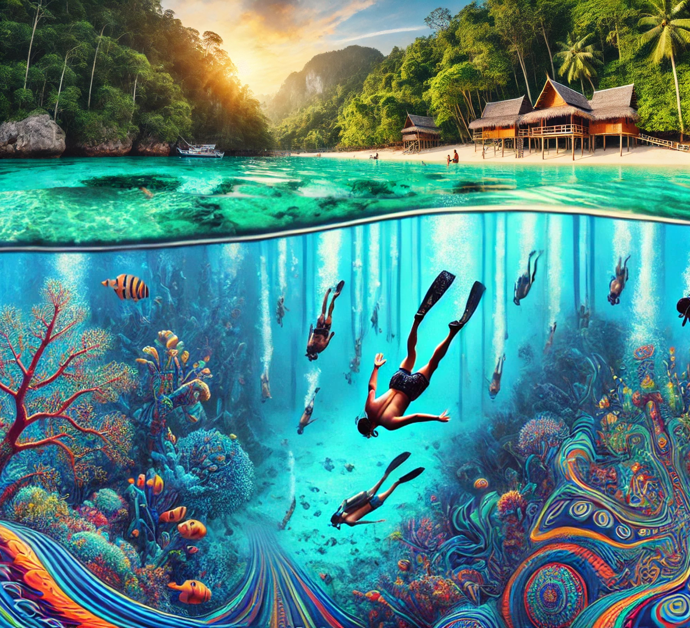

{:.max-w-sm .mx-auto}

{:.text-3xl .font-bold .tracking-tight .animate .ease .fadeIn .delay-500 .flex .text-center .justify-center .sm:text-8xl .mb-16 .z-1 .relative .inline-block .w-full .line-height[2em] .font-light}
nonduality.today

{:.text-2xl .sm:text-4xl .font-bold .tracking-tight .animate .ease .fadeIn .delay-500 .flex .justify-center .sm:text-6xl .mb-16 .z-1 .relative .bg-gradient-to-r .from-blue-600 .via-green-500 .to-red-500 .inline-block .text-transparent .bg-clip-text .pb-2}
# Freediving Meditation Retreat

{:.text-center .mb-8 .mt-0}
The beauty of nature multiplied by the depths of consciousness.

{:.text-2xl .sm:text-4xl .text-center .mb-8 .mt-0}
## **Phuket, Thailand**

{:.text-2xl .sm:text-3xl .text-center .mb-8 .mt-0}
Feb 17th—20th, 2025

# 🫧 Highpoint
We peak during an exclusive **4 day package trip** to the stunning Surin Islands in a protected Oceanic National Park World Heritage Site in Phang Nga, Thailand.

# 🗓️ Dates for 2025

Carefully selected for optimal experience. Near the end of the touristic season, when it's not that hot. Aligned with the Moon so there are is no tide, no current, and less tourists.

{:.text-2xl .sm:text-3xl .font-bold .mb-8 .mt-0}
- Feb 17th—20th, 2025

# 🏝️ Surin Islands Experience
Clear water, vibrant coral reefs and diverse marine life. We stay in tents on a beach. Two ocean trips a day with a break in between. Included:
- Crystal-clear waters
- Vibrant coral reefs
- Diverse marine life
- Beachside tent accommodations
- Two daily ocean exploration trips
- Beachside tents
- Food and drinks

# 🧘‍♀️  Personal Transformation Path
I welcome everybody to try the awakening path I went. Following a meditation schedule with a certain state of mind one can get to freeing oneself in about a week.
- Meditation practices
- Mindfulness techniques
- Deep personal exploration
- Awareness games
- Consciousness expansion*

# 🗓️ The Schedule
Plan two weeks. Don't book it day-to-day. We'll stay in Phuket get used to the jet lag and the sun. If you never tried freediving – a 3-day freediving course is available. Then we travel to the islands, spend a few days living in nature. With plenty of time with the ocean.

It's two dives a day with some break days and plenty of rest and chill in between. To go deeper, you got to let go.

- Wake up
- Yoga
- Breakfast
- Open Water
- Rest
- Open Water
- Integration/Workshop

# 🌊 Freediving and Ocean Connection

Discover the art of:
- Breath control
- Marine environment awareness
- Personal limits exploration
- Meditative ocean interactions

# ☀️ Natural Environment

The weather in Thailand during this time is warm, with temperatures ranging from 26-28°C (79-82°F) throughout the day. The clear waters and breathtaking scenery will provide the perfect backdrop for our journey of self-discovery.

- Warm tropical climate (26-28°C)
- Breathtaking scenery
- Serene natural backdrop
- Perfect setting for personal growth

# 🌿 Integration and Reflection

Insights are plenty, and we will discuss and help to integrate the experience before embarking onto the next adventures.

- Guided processing of experiences
- Community sharing
- Personal insight development

{:.text-center.text-4xl}
# 🇹🇭

{:.text-center}
# ♥️ Oneness in the heart of Thailand!

{:.px-4 .rounded}

  <h1 class="mt-0">Past Trips</h1>
  <h2>Teriberka, North Polar Circle</h2>

  

    

      

        
      

    

    

      

        
      

    

    

      

        
      

    

  

  <h2>Phuket, Thailand</h2>

  

    

      

        
      

    

    

      

        
      

    

    

      

        
      

    

  

  <h2>Phang-Nga, Thailand</h2>

  

    

      

        
      

    

    

      

        
      

    

    

      

        
      

    

  

